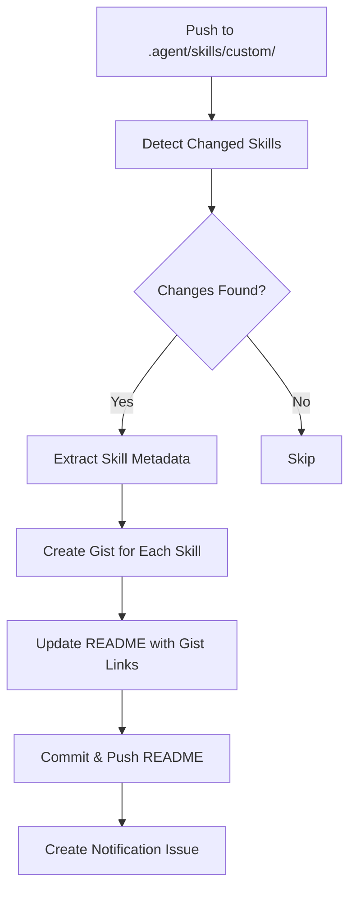
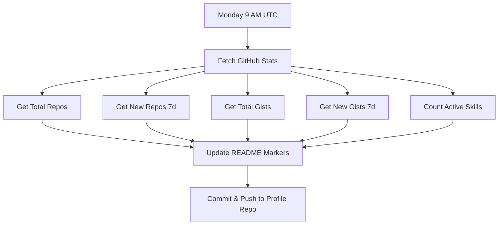

# 🤖 Automation Workflows - Setup Guide

This repository includes 2 automated workflows using GitHub Actions:

1. **Skill Publishing Pipeline** - Auto-creates Gists when you add/update skills
2. **Profile Auto-Update** - Weekly refresh of your GitHub profile README

---

## 📋 Table of Contents

- [Workflow B: Skill Publishing Pipeline](#workflow-b-skill-publishing-pipeline)
- [Workflow C: Profile Auto-Update](#workflow-c-profile-auto-update)
- [Setup Instructions](#setup-instructions)
- [Testing the Workflows](#testing-the-workflows)

---

## 🎯 Workflow B: Skill Publishing Pipeline

**File**: `.github/workflows/publish-skills.yml`

### What It Does

Automatically publishes new or updated skills as GitHub Gists and updates the README.

### Triggers

1. **Automatic** (on push):

   ```yaml
   on:
     push:
       branches: [main]
       paths:
         - ".agent/skills/custom/**"
   ```

   - **When**: You push changes to `.agent/skills/custom/` directory
   - **Example**: You create a new skill or update `SKILL.md`

2. **Manual** (workflow_dispatch):
   ```yaml
   on:
     workflow_dispatch:
   ```

   - **When**: You manually trigger it from GitHub Actions tab
   - **How**: Go to Actions → Skill Publishing Pipeline → Run workflow

### Workflow Steps



### What Gets Created

1. **GitHub Gist** for each new/modified skill
2. **Updated README.md** with Gist link in "Featured Gists" section
3. **GitHub Issue** with summary of published skills

### Example Output

When you add a new skill `data-architect`, the workflow will:

1. Create Gist: `https://gist.github.com/LuisSambrano/abc123`
2. Update README:
   ```markdown
   ## 📝 Featured Gists

   - **[data-architect](https://gist.github.com/...)** - New skill showcase
   ```
3. Create issue:

   ```
   Title: 📝 New Skills Published - 2026-01-28
   Body:
   ## 🎉 New Skills Published
   - **data-architect**: https://gist.github.com/...

   **Next Steps (Manual)**:
   1. Review the Gists for accuracy
   2. Share on social media
   3. Close this issue when done
   ```

---

## 📅 Workflow C: Profile Auto-Update

**File**: `.github/workflows/profile-update.yml`

### What It Does

Automatically updates your GitHub profile README with latest stats every week.

### Triggers

1. **Scheduled** (cron):

   ```yaml
   on:
     schedule:
       - cron: "0 9 * * 1"
   ```

   - **When**: Every Monday at 9 AM UTC (6 AM Argentina time)
   - **Frequency**: Weekly

2. **Manual** (workflow_dispatch):
   ```yaml
   on:
     workflow_dispatch:
   ```

   - **When**: You manually trigger it from GitHub Actions tab
   - **How**: Go to Actions → Profile Auto-Update → Run workflow

### Workflow Steps



### What Gets Updated

Your profile README (`LuisSambrano/LuisSambrano/README.md`) between these markers:

```markdown
<!-- STATS:START -->

**📊 Weekly Activity**

- 📦 Total Repositories: 15
- 🆕 New Repos (7d): 2
- 📝 Total Gists: 8
- ✨ New Gists (7d): 3
- 🛠️ Active Skills: 3

_Last updated: 2026-01-28 09:00 UTC_

<!-- STATS:END -->

<!-- GISTS:START -->

- **[Antigravity Architect - Live Demo](https://gist.github.com/...)**
- **[Gemini 1.5 Pro - Prompt Template](https://gist.github.com/...)**
- **[Supabase RLS Patterns](https://gist.github.com/...)**
<!-- GISTS:END -->
```

---

## 🛠️ Setup Instructions

### Prerequisites

- GitHub account with Actions enabled
- Personal Access Token (for Profile Auto-Update)

### Step 1: Enable GitHub Actions

1. Go to `google-antigravity` repository
2. Click **Settings** → **Actions** → **General**
3. Under "Workflow permissions", select:
   - ✅ **Read and write permissions**
   - ✅ **Allow GitHub Actions to create and approve pull requests**
4. Click **Save**

### Step 2: Create Personal Access Token (for Profile Auto-Update)

1. Go to GitHub Settings → Developer settings → Personal access tokens → Tokens (classic)
2. Click **Generate new token (classic)**
3. Name: `PROFILE_UPDATE_TOKEN`
4. Scopes:
   - ✅ `repo` (Full control of private repositories)
   - ✅ `workflow` (Update GitHub Action workflows)
5. Click **Generate token**
6. **Copy the token** (you won't see it again!)

### Step 3: Add Secret to Repository

1. Go to `google-antigravity` repository
2. Click **Settings** → **Secrets and variables** → **Actions**
3. Click **New repository secret**
4. Name: `PROFILE_UPDATE_TOKEN`
5. Value: Paste the token from Step 2
6. Click **Add secret**

### Step 4: Prepare Your Profile README

Add these markers to your profile README (`LuisSambrano/LuisSambrano/README.md`):

```markdown
## 📊 Activity

<!-- STATS:START -->
<!-- This section will be auto-updated weekly -->
<!-- STATS:END -->

## 📝 Latest Gists

<!-- GISTS:START -->
<!-- This section will be auto-updated weekly -->
<!-- GISTS:END -->
```

### Step 5: Test the Workflows

#### Test Skill Publishing Pipeline

```bash
# Create a test skill
mkdir -p .agent/skills/custom/test-skill
echo "---
name: test-skill
description: A test skill
---
# Test Skill
This is a test." > .agent/skills/custom/test-skill/SKILL.md

# Commit and push
git add .agent/skills/custom/test-skill
git commit -m "test: add test skill"
git push
```

Then check:

1. Go to **Actions** tab
2. Click on the running workflow
3. Wait for completion
4. Check if Gist was created and README updated

#### Test Profile Auto-Update

1. Go to **Actions** tab
2. Click **Profile Auto-Update**
3. Click **Run workflow** → **Run workflow**
4. Wait for completion
5. Check your profile README for updated stats

---

## 🔧 Customization

### Change Update Frequency

Edit `.github/workflows/profile-update.yml`:

```yaml
schedule:
  # Daily at 9 AM UTC
  - cron: "0 9 * * *"

  # Every 3 days at 9 AM UTC
  - cron: "0 9 */3 * *"

  # First day of month at 9 AM UTC
  - cron: "0 9 1 * *"
```

**Cron syntax**: `minute hour day month weekday`

### Disable a Workflow

1. Go to **Actions** tab
2. Click on the workflow name
3. Click **⋯** (three dots) → **Disable workflow**

---

## 🐛 Troubleshooting

### Workflow Not Running

**Problem**: Pushed changes but workflow didn't trigger

**Solution**:

1. Check if path matches: `.agent/skills/custom/**`
2. Verify Actions are enabled in Settings
3. Check workflow file syntax (YAML is strict about indentation)

### Permission Denied

**Problem**: `Error: Resource not accessible by integration`

**Solution**:

1. Go to Settings → Actions → General
2. Enable "Read and write permissions"
3. Re-run the workflow

### Profile Update Fails

**Problem**: `Error: Authentication failed`

**Solution**:

1. Verify `PROFILE_UPDATE_TOKEN` is set correctly
2. Check token hasn't expired
3. Ensure token has `repo` and `workflow` scopes

---

## 📚 Resources

- [GitHub Actions Documentation](https://docs.github.com/en/actions)
- [Cron Syntax](https://crontab.guru/)
- [GitHub CLI](https://cli.github.com/)

---

**Built with ❤️ by Luis Sambrano | Powered by GitHub Actions**
